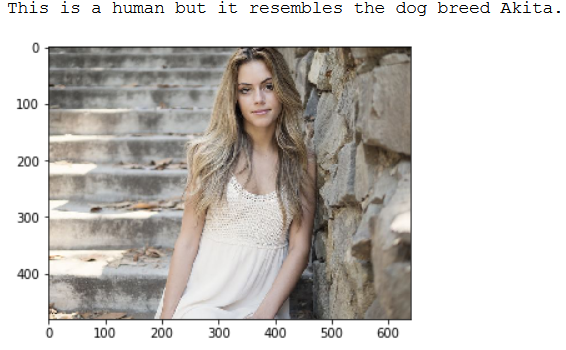

# Pretrained-Image-Classifier-to-Identify-Dog-Breeds-using-Python
Udacity AI Programming with Python Nanodegree : First Project - Pretrained Image Classifier to Identify Dog Breeds using Python


The purpose of this project is to use a Convolutional Neural Network (CNN) to predict dog breeds. The pipeline involves evaluating an image as either a dog or a human, then making a prediction of which dog breed the dog is, or which dog breed the human most resembles. 


## Table of Contents
1. [Introduction](#introduction)
2. [Software Requirements](#software_requirements)
3. [Folder Structure](#folder_structure)
4. [Getting Started](#getting_started)
5. [Running APP](#running_app)
    1. [Detect Humans Face](#detect_humans_face)
    2. [Classify Dog Breeds](#classify_dog_breeds)
6. [Project Results](#project_results)    
7. [Authors](#authors)
8. [Project Motivation](#motivation)
9. [Acknowledgements](#acknowledgement)


<a name="introduction"></a>

## Introduction

In this Udacity nanodegree, I created a pipeline as part of the Capstone Project that can be used in a web or mobile app to process real images taken by users.. Based on an image of a dog, the algorithm I created can make an assessment about the breed. If supplied an image of a human, the code will identify the corresponding dog breed.

<a name="software_requirements"></a>

## Software Requirements

Required libraries:

+ Python 3.x
+ Scikit-Learn
+ Keras
+ TensorFlow
+ Numpy
+ Pandas
+ Matplotlib
+ 
Please run ```pip install -r requirements.txt```


<a name="folder_structure"></a>

## Folder Structure

```
C:.

```


<a name="getting_started"></a>

## Getting Started

1. Make sure Python 3 is installed.
2. Clone the repository and navigate to the project's root directory in the terminal
3. Download the [dog dataset](https://s3-us-west-1.amazonaws.com/udacity-aind/dog-project/dogImages.zip). Unzip the folder and place the three files (test, train and valid) in the cloned repository in the folder ```data/dog_images```. If one of these folders does not yet exist, please create it manually. 
4. Download the [human dataset](https://s3-us-west-1.amazonaws.com/udacity-aind/dog-project/lfw.zip). Unzip the folder and place it in the cloned repository in the folder ```data/lfw```. If one of these folders does not yet exist, please create it manually. 
5. Download the [VGG-19](https://s3-us-west-1.amazonaws.com/udacity-aind/dog-project/DogVGG19Data.npz) and [InceptionV3](https://s3-us-west-1.amazonaws.com/udacity-aind/dog-project/DogInceptionV3Data.npz) bottleneck features and place them in the cloned repository in the folder ```bottleneck_features```. If this folder does not yet exist, please create it manually. 
6. Start the notebook ```dog_app.ipynb```.


<a name="running_app"></a>

## Running APP


<a name="classify_dog_breeds"></a>

### Classify Dog Breeds

I used transfer learning to create a convolutional neural network (CNN). I used this to determine the breed of dog from dog pictures. 

+ If a dog is recognised in the image supplied, the algorithm returns the corresponding breed:


+ If a human is recognised in the image provided, the algorithm returns the resembling dog breed:




+ If neither a human nor a dog can be seen in the picture, the algorithm returns the following error message: "Error: Please input an image of a human or a dog."

<a name="project_results"></a>

## Project Results

To summarize, the transfer learning CNN model that I built outperformed the CNN that I created from scratch. The pre-trained InceptionV3-model, which was trained on over a million images from the ImageNet dataset, achieved an accuracy of 80%, while the CNN from scratch only achieved 5%. This significant difference in performance can be attributed to the use of a vast amount of pre-existing training data that went into the pre-trained model. Had I used data augmentation during the training process, I could have potentially improved the accuracy of the CNN from scratch. When tested using new images, the transfer learning CNN performed sufficiently well, though not perfectly. 

<a name="authors"></a>

## Authors

+ [Shriyash Gulhane](https://github.com/shrigulhane100)

<a name="motivation"></a>

## Project Motivation: 

Udacity has given students the freedom to choose the area in which they would like to complete their capstone project. Possible technical fields would have been:

+ [Robot Motion Planning](https://docs.google.com/document/d/1ZFCH6jS3A5At7_v5IUM5OpAXJYiutFuSIjTzV_E-vdE/pub)
+ [Healthcare](https://docs.google.com/document/d/1WzurKKa9AX2DnOH7KiB38mvozdOSemfkGpex8hdTy8c/pub)
+ [Computer Vision](https://docs.google.com/document/d/1y-XfjkPFgUQxFIQ9bBncUSjs4HOf5E-45FrLYNBsZb4/pub)
+ [Education](https://docs.google.com/document/d/1vjerjRQnWs1kLbZagDYT6rNqiwAG23Yj45oUY88IAxI/pub)
+ [Investment and Trading](https://docs.google.com/document/d/1ycGeb1QYKATG6jvz74SAMqxrlek9Ed4RYrzWNhWS-0Q/pub)

As I am personally very interested in Deep Learning and have already completed my Nanodegree in AI via Udacity, I found it exciting to complete my capstone project in this area as well. 
So I choose to use Convolutional Neural Networks to Identify Dog Breeds.

<a name="acknowledgement"></a>

## Acknowledgements

I thank [Udacity](https://www.udacity.com/) for providing this challenge and learning experience. 
